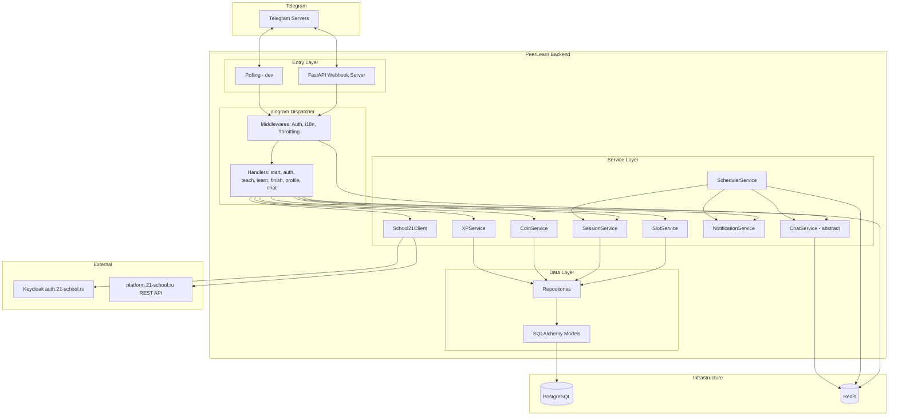
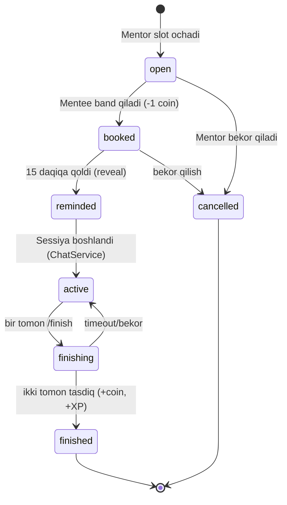
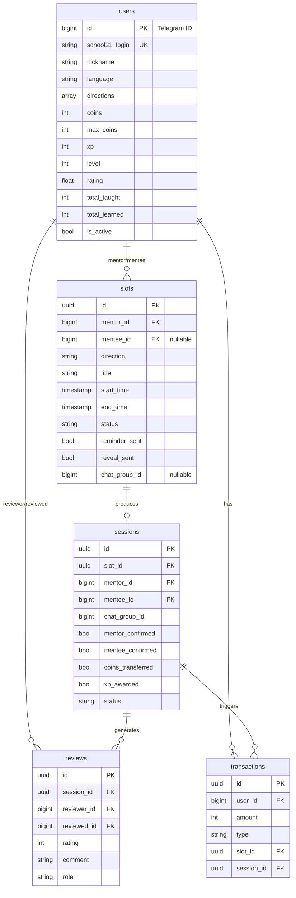

# Design Document — PeerLearn Bot Backend

## Overview

PeerLearn Bot — School 21 talabalari uchun anonim p2p bilim almashish platformasi. Backend Python 3.11+ asosida, `aiogram 3.x` (Telegram bot framework), `FastAPI` (webhook server), `SQLAlchemy 2.x async` (ORM), `PostgreSQL` (asosiy baza), `Redis` (FSM storage + cache + relay + scheduler jobstore) va `APScheduler` (background jobs) dan foydalanadi.

Asosiy oqim:
1. Foydalanuvchi `/start` → School 21 Keycloak orqali autentifikatsiya → yo'nalish tanlash → ro'yxatdan o'tish.
2. Mentor slot ochadi (`open`).
3. Mentee slotni anonim ko'radi va band qiladi (`booked`), 1 tanga sarflaydi.
4. Slot boshlanishidan 15 daqiqa oldin scheduler ikki tomonga eslatma yuboradi va kimligini oshkor qiladi (`reminded`).
5. Slot vaqti kelganda sessiya yaratiladi (`active`), `ChatService` orqali aloqa kanali o'rnatiladi.
6. Tomonlar `/finish` orqali sessiyani yakunlaydi, izoh qoldiradi. Ikki tomon tasdiqlasa — mentor +1 tanga, +XP oladi (`finished`).

Bu hujjat haqiqiy School 21 API (REST + Keycloak) bilan tasdiqlangan integratsiyaga asoslanadi.

### Design Goals

- **Anonimlik:** Reveal vaqtigacha (15 daqiqa oldin) tomonlar bir-birini bilmaydi.
- **Atomiklik:** Slot band qilish va coin/XP o'tkazish race-condition'siz, idempotent.
- **Kengaytiriluvchanlik:** `ChatService` abstraksiyasi — Relay (MVP) bugun, UserBot ertaga.
- **Toza arxitektura:** Handler → Service → Repository → Model qatlamlari.
- **Idempotentlik:** Coin/XP mukofotlari bayroqlar (`coins_transferred`, `xp_awarded`) orqali bir marta beriladi.

## Architecture

### Yuqori darajadagi diagramma



### Slot va sessiya holat mashinasi (State Machine)



### Qatlamli arxitektura

| Qatlam | Mas'uliyat |
|---|---|
| **Handlers** | Telegram update'larni qabul qilish, FSM holatlarini boshqarish, javob qaytarish |
| **Keyboards** | Inline/reply tugmalarni yaratish |
| **Middlewares** | Auth tekshirish, i18n til aniqlash, throttling |
| **States** | aiogram FSM holatlari (auth, teach, learn, finish) |
| **Services** | Biznes-logika (slot, sessiya, coin, XP, scheduler, chat) |
| **Repositories** | DB operatsiyalari (CRUD, atomik so'rovlar) |
| **Models** | SQLAlchemy ORM modellar |

## Components and Interfaces

### 1. Configuration (`bot/config.py`)

Pydantic `BaseSettings` orqali `.env` dan o'qiladi. PRD'dagi School21 GraphQL maydonlari Keycloak/REST'ga moslashtiriladi:

```python
class Settings(BaseSettings):
    # Bot
    BOT_TOKEN: str
    WEBHOOK_URL: str = ""
    WEBHOOK_PATH: str = "/webhook"
    SECRET_KEY: str

    # DB / Redis
    DATABASE_URL: str
    REDIS_URL: str = "redis://localhost:6379/0"

    # School 21 (Keycloak + REST)
    S21_TOKEN_URL: str = "https://auth.21-school.ru/auth/realms/EduPowerKeycloak/protocol/openid-connect/token"
    S21_API_URL: str = "https://platform.21-school.ru/services/21-school/api/v1"
    S21_CLIENT_ID: str = "s21-open-api"

    # App constants
    DEBUG: bool = False
    DEFAULT_COINS: int = 5
    MAX_COINS: int = 15
    REMINDER_MINUTES: int = 15
    XP_PER_SESSION: int = 50
    COIN_PER_SESSION: int = 1
    SESSION_DEFAULT_MINUTES: int = 60

    # Chat backend: "relay" | "userbot"
    CHAT_BACKEND: str = "relay"

    # Admin
    ADMIN_IDS: List[int] = []
```

### 2. School21 Client (`bot/services/school21_api.py`)

PRD'dagi GraphQL kod **REST + Keycloak** bilan almashtiriladi (haqiqiy, tasdiqlangan oqim):

```python
class School21Client:
    async def authenticate(self, login: str, password: str) -> dict | None:
        """
        Keycloak password grant. Muvaffaqiyatda:
        {access_token, refresh_token, expires_in, ...} qaytaradi, aks holda None.
        POST S21_TOKEN_URL
          data: client_id=s21-open-api, grant_type=password, username, password
        """

    async def get_profile(self, login: str, access_token: str) -> dict | None:
        """
        GET {S21_API_URL}/participants/{login}
          headers: Authorization: Bearer {access_token}
        Qaytaradi: {login, className, parallelName, expValue, level,
                    expToNextLevel, campus, status}
        """

    async def get_skills(self, login: str, access_token: str) -> list[dict]:
        """
        GET {S21_API_URL}/participants/{login}/skills
        Qaytaradi: [{name, points}, ...] — yo'nalish taklifi uchun.
        """
```

**Skill → Direction mapping** (yo'nalishni avtomatik taklif qilish uchun):

```python
SKILL_TO_DIRECTION = {
    "Python": "python", "ML & AI": "ml_ai", "Algorithms": "algorithms",
    "C": "c_lang", "SQL": "database", "DB & Data": "database",
    "Linux": "devops", "Network & system administration": "devops",
    "Graphics": "game_dev", "OOP": "backend", "Shell/Bash": "devops",
}
```

> **Eslatma:** Profil endpoint `avatar_url` qaytarmaydi, shuning uchun `avatar_url` `NULL` qoldiriladi. Parol hech qachon saqlanmaydi; `access_token` faqat ro'yxatdan o'tish davomida xotirada ishlatiladi.

### 3. Data Models — qatlam izohi (`bot/database/models/`)

PRD sxemasiga muvofiq SQLAlchemy ORM modellar. To'liq sxema va ER diagramma quyidagi `## Data Models` bo'limida keltirilgan.

### 4. Repositories (`bot/repositories/`)

Atomiklik talab qiladigan operatsiyalar SQL darajasida shartli `UPDATE` orqali bajariladi (race-condition'siz):

```python
class SlotRepository:
    async def get_by_id(self, slot_id) -> Slot | None: ...
    async def create(self, **kwargs) -> Slot: ...
    async def get_available_slots(self, direction, exclude_user_id) -> list[Slot]: ...

    async def book_slot_atomic(self, slot_id, mentee_id) -> bool:
        """
        UPDATE slots SET status='booked', mentee_id=:mentee_id
        WHERE id=:slot_id AND status='open' AND mentor_id != :mentee_id
        RETURNING id;
        Faqat bitta mentee muvaffaqiyatli band qiladi (atomik).
        """

    async def get_slots_for_reminder(self, now, threshold) -> list[Slot]:
        """status='booked' AND reminder_sent=false AND start_time<=threshold"""

    async def get_slots_to_start(self, now) -> list[Slot]:
        """status='reminded' AND start_time<=now"""
```

`UserRepository`, `SessionRepository`, `TransactionRepository` ham CRUD + maxsus so'rovlar bilan.

### 5. Services

#### SlotService
Slot ochish (vaqt validatsiyasi: `end > start`, `start > now`), ochiq slotlarni anonim ro'yxatlash, atomik band qilish.

#### CoinService — idempotent
```python
class CoinService:
    async def deduct(self, user_id, amount, reason, slot_id=None) -> bool:
        """
        Atomik: UPDATE users SET coins = coins - :amount
        WHERE id=:user_id AND coins >= :amount RETURNING coins;
        Muvaffaqiyatda transactions yozuvi qo'shadi.
        """
    async def reward_mentor(self, session) -> None:
        """
        IF session.coins_transferred: return  (idempotent)
        coins = min(coins + COIN_PER_SESSION, max_coins)
        transactions += earn_teach; session.coins_transferred = True
        """
```

#### XPService — idempotent
PRD'dagi `XP_TABLE` va `_calculate_level` ishlatiladi. `award_xp` `xp_awarded` bayrog'i bilan himoyalanadi. Mentor +50 XP & `total_taught++`, mentee +25 XP & `total_learned++`. Level oshsa — natija qaytariladi (notification uchun).

#### SessionService
Sessiya yaratish, `/finish` oqimi: bir tomon tasdig'ini saqlash, ikki tomon tasdiqlasa `finished`, `reviews` ga yozish, coin+XP'ni trigger qilish.

```python
class SessionService:
    async def create_session(self, slot, chat_ref) -> Session: ...
    async def get_active_session_by_user(self, user_id) -> Session | None: ...
    async def submit_finish(self, session_id, user_id, comment, rating=None) -> Session:
        """
        Tasdiqlovchini aniqlash (mentor yoki mentee), tegishli *_confirmed=True,
        review yozish. Ikkala confirmed bo'lsa status='finished'.
        """
```

#### ChatService — abstraksiya (asosiy kengaytirish nuqtasi)

```python
class ChatService(ABC):
    @abstractmethod
    async def open_channel(self, session: Session) -> str:
        """Aloqa kanalini ochadi, chat_ref (relay id yoki group_id) qaytaradi."""
    @abstractmethod
    async def relay(self, session: Session, from_user_id: int, message: Message) -> None:
        """Xabarni qarama-qarshi tomonga yetkazadi (relay rejimida)."""
    @abstractmethod
    async def close_channel(self, session: Session) -> None:
        """Kanalни yopadi/tozalaydi."""

class RelayChatService(ChatService):
    """MVP. Redis: relay:{session_id}:mentor / :mentee / :active.
       chat.py handleri orqali xabarlarni copy_message bilan uzatadi.
       Matn, rasm, fayl, ovozli — bot.copy_message universal ishlaydi."""

class UserBotChatService(ChatService):
    """Kelajak. Telethon/Pyrogram orqali haqiqiy guruh yaratadi,
       ikki tomonni + botni qo'shadi, sessiya tugagach guruhni o'chiradi."""
```

`CHAT_BACKEND` setting orqali factory tanlaydi (`get_chat_service(bot)`).

#### SchedulerService
APScheduler `AsyncIOScheduler` (memory jobstore). Har 1 daqiqada `check_slots`:
1. `get_slots_for_reminder` → `send_reminder` (reveal) → `reminder_sent=True`, status `reminded`.
2. `get_slots_to_start` → `SessionService.create_session` + `ChatService.open_channel` → status `active`.

> **Eslatma:** PRD'dagi `RedisJobStore(host=settings.REDIS_URL)` ikki sababga ko'ra ishlamaydi: (1) `host` URL emas, host/port kutadi; (2) yagona vazifa `check_slots` botning `SSLContext` obyektiga bog'langan bo'lib, uni Redis uchun pickle qilib bo'lmaydi. Yechim: memory jobstore ishlatamiz — vazifa har ishga tushishda qayta qo'shiladi, slot holatlari esa PostgreSQL'da turg'un saqlanadi (idempotent `mark_reminder_sent` orqali takror eslatma oldini olamiz).

#### NotificationService
Bir joydan xabar yuborish (i18n + xatolarni yutish). `try/except` bilan `TelegramForbiddenError` (bot bloklangan) holatlarini boshqaradi.

### 6. Handlers va FSM

PRD'dagi handlerlar saqlanadi: `start`, `auth`, `menu`, `calendar`, `teach`, `learn`, `chat`, `finish`, `profile`, `settings`, `admin`. FSM holatlar: `AuthStates`, `TeachStates`, `LearnStates`, `FinishStates`, `SettingsStates`.

**Yangi:** `chat.py` — relay rejimida faol sessiyasi bor foydalanuvchidan kelgan har qanday xabarni (FSM holatda bo'lmasa) qarama-qarshi tomonga `copy_message` orqali uzatadi.

### 7. Middlewares

- **AuthMiddleware:** `event.from_user.id` bo'yicha userni yuklaydi, `data["user"]` ga qo'yadi. Ro'yxatdan o'tmagan bo'lsa faqat `/start` va `AuthStates` ga ruxsat.
- **I18nMiddleware:** user tilini aniqlab, `data["_"]` (tarjima funksiyasi) beradi.
- **ThrottlingMiddleware:** Redis token-bucket (har user uchun X so'rov / Y soniya).

### 8. Entry point (`bot/main.py` + webhook server)

- DEBUG=True → `dp.start_polling`.
- DEBUG=False → FastAPI `aiohttp`/`uvicorn` webhook server, `bot.set_webhook` + `SimpleRequestHandler`.

## Data Models

Quyida ma'lumotlar bazasi sxemasi va modellararo bog'lanishlar keltirilgan. Asosiy qaror: `users.school21_login` majburiy va unique; `level`/`xp` School 21 dan emas, **ichki** PeerLearn progresi sifatida saqlanadi (boshlang'ich qiymat School 21 dan olinishi mumkin, lekin sessiyalar ichki XP'ni o'zgartiradi). `status` maydonlari PostgreSQL native `Enum` o'rniga `String` + Python `enum.StrEnum` sifatida saqlanadi (migratsiya egiluvchanligi uchun).



### Jadval tafsilotlari

- **users:** `id` = Telegram user_id (BIGINT PK). `coins` standart 5, `max_coins` 15. `directions` — `ARRAY(String)`. `rating` 0-100 oralig'ida (foiz). Indeks: PK.
- **slots:** `id` UUID. `status` ∈ {`open`, `booked`, `reminded`, `active`, `finished`, `cancelled`}. Indekslar: `status`, `direction`, `start_time`, `mentor_id`.
- **sessions:** `id` UUID. `status` ∈ {`active`, `finishing`, `finished`, `disputed`}. Idempotentlik bayroqlari: `coins_transferred`, `xp_awarded`, `mentor_confirmed`, `mentee_confirmed`.
- **transactions:** `type` ∈ {`earn_teach`, `spend_learn`, `bonus`, `penalty`}. `amount` musbat yoki manfiy.
- **reviews:** `rating` 1-5 (CHECK). `role` ∈ {`mentor`, `mentee`}.

### XP jadvali (level chegaralari)

| Level | Nom | XP |
|---|---|---|
| 1 | Newbie | 0–99 |
| 2 | Beginner | 100–249 |
| 3 | Learner | 250–499 |
| 4 | Practitioner | 500–999 |
| 5 | Expert | 1000–1999 |
| 6 | Master | 2000–4999 |
| 7 | Legend | 5000+ |

Mukofotlar: o'rgatish +50 XP, o'rganish +25 XP.

## Correctness Properties

Tizim quyidagi invariantlarni har doim saqlashi kerak:

### Property 1: Coin nomanfiyligi
Hech bir foydalanuvchining `coins` qiymati 0 dan kichik bo'lmasligi kerak. Band qilish faqat atomik `UPDATE ... WHERE coins >= amount` orqali, balans yetganda amalga oshadi.
**Validates: Requirements 3.2, 7.1, 7.6**

### Property 2: Coin cap
`coins` hech qachon `max_coins` (15) dan oshmasligi kerak; mukofot `min(coins + reward, max_coins)` bilan cheklanadi.
**Validates: Requirements 7.3**

### Property 3: Slot band qilish yagonaligi
Bitta `open` slot ko'pi bilan bitta `mentee` ga biriktiriladi. Parallel urinishlarda atomik `UPDATE ... WHERE status='open' RETURNING` faqat bittasini muvaffaqiyatli qiladi.
**Validates: Requirements 3.6, 3.7**

### Property 4: O'z slotini band qilmaslik
`mentee_id != mentor_id` (band qilish so'rovida tekshiriladi).
**Validates: Requirements 3.3**

### Property 5: Coin/XP idempotentligi
Har bir sessiya uchun coin (`coins_transferred`) va XP (`xp_awarded`) ko'pi bilan bir marta beriladi, takroriy `/finish` yoki qayta ishga tushishda takrorlanmaydi.
**Validates: Requirements 7.5, 8.5**

### Property 6: Anonimlik invarianti
`reveal_sent=false` bo'lgan slot uchun mentee'ga mentor identifikatori (va aksincha) hech qachon yuborilmaydi.
**Validates: Requirements 3.4, 4.2**

### Property 7: Eslatma yagonaligi
Har bir slot uchun eslatma (`reminder_sent`) ko'pi bilan bir marta yuboriladi.
**Validates: Requirements 4.3, 4.4**

### Property 8: Holat monotonligi
Slot/sessiya statuslari faqat ruxsat etilgan o'tishlar bo'yicha o'zgaradi (state machine'ga muvofiq); `finished`/`cancelled` terminal holatlar.
**Validates: Requirements 5.1, 6.6**

### Property 9: Tranzaksiya izi
Har bir coin o'zgarishi uchun `transactions` jadvalida mos yozuv bo'lishi kerak (audit izchilligi).
**Validates: Requirements 7.4**

### Property 10: Level izchilligi
`level` har doim `xp` ga mos keladi (`_calculate_level(xp)` natijasi bilan).
**Validates: Requirements 8.3**

## Error Handling

| Holat | Strategiya |
|---|---|
| School 21 auth muvaffaqiyatsiz (401/timeout) | Foydalanuvchiga "login/parol noto'g'ri", FSM clear, qayta `/start` |
| School 21 API timeout (profil) | `httpx` timeout=30s; xato bo'lsa minimal ma'lumot bilan davom etish |
| Slot band qilishda race | Atomik `UPDATE ... RETURNING`; muvaffaqiyatsiz bo'lsa "allaqachon band" |
| Coin yetarli emas | Atomik shartli UPDATE; bloklab "yetarli tanga yo'q" |
| Takroriy coin/XP mukofot | `coins_transferred` / `xp_awarded` bayroqlari |
| Bot foydalanuvchi tomonidan bloklangan | `TelegramForbiddenError` yutiladi, log qilinadi |
| Scheduler job ichida xato | Har slot `try/except` bilan izolyatsiya, log, boshqalar davom etadi |
| Webhook secret mos kelmasa | FastAPI 401 qaytaradi |

Barcha service operatsiyalari DB tranzaksiyasida; xato bo'lsa `rollback`.

## Testing Strategy

- **Unit testlar (`tests/test_services/`):**
  - `XPService._calculate_level` — XP jadvali chegaralari.
  - `CoinService` — idempotentlik, MAX_COINS cap, yetarsiz balans.
  - `SlotService` — vaqt validatsiyasi.
  - `School21Client` — `httpx.MockTransport` bilan auth/profil parse.
- **Integratsion testlar (`tests/test_handlers/`):**
  - SQLite/Postgres test bazasi + aiogram mock bilan FSM oqimlari (auth → teach → learn → finish).
  - Atomik `book_slot` — ikki parallel band qilish urinishidan faqat biri muvaffaqiyatli.
- **Scheduler:** `check_slots` ni mock vaqt bilan, reminder/start o'tishlarini tekshirish.
- School 21 tashqi API mock'lanadi (real tarmoqqa testda chiqilmaydi).

## Open Decisions (kelajak uchun)

- **Rating hisoblash:** Hozircha `reviews.rating` (1-5) o'rtachasi → foiz (`avg * 20`). MVP'da reveal'dan keyin baholash ixtiyoriy.
- **Chat backend:** MVP `relay`. UserBot interfeysga mos qoladi, keyin yoqiladi.
- **Title/description:** Slot uchun ixtiyoriy maydonlar — MVP'da auto-title (`{direction} sessiyasi`).
