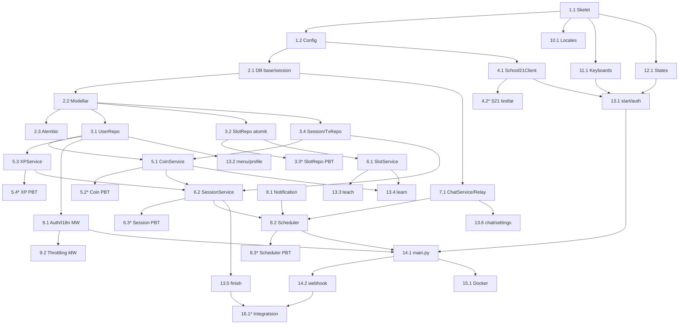

# Implementation Plan — PeerLearn Bot Backend

## Overview

Ushbu reja PeerLearn Bot backendini qatlamli tartibda quradi: konfiguratsiya → DB → repository → servislar → ChatService → scheduler → middleware → i18n → keyboards → states → handlers → entry point → deploy → integratsion testlar. Pastdan yuqoriga (bottom-up) yondashuv: avval poydevor (model, repo, servis) test bilan mustahkamlanadi, keyin handler'lar ulanadi. `*` bilan belgilangan vazifalar — property-based/unit testlar (ixtiyoriy, lekin invariantlar uchun tavsiya etiladi).

## Tasks

- [x] 1. Loyiha skeleti va konfiguratsiya
- [x] 1.1 Loyiha tuzilmasi va bog'liqliklarni o'rnatish
  - `peerlearn_bot/` papka tuzilmasini PRD bo'limi 4 ga muvofiq yaratish (`bot/`, `bot/handlers/`, `bot/services/`, `bot/database/`, `bot/repositories/`, `bot/keyboards/`, `bot/middlewares/`, `bot/states/`, `bot/utils/`, `bot/locales/`, `tests/`)
  - `requirements.txt` ni PRD bo'limi 10 dagi versiyalar bilan yaratish (aiogram 3.13.1, fastapi, sqlalchemy[asyncio], asyncpg, alembic, redis[hiredis], apscheduler, httpx, pydantic, pydantic-settings)
  - `.env.example`, `.gitignore`, bo'sh `__init__.py` fayllarini yaratish
  - _Requirements: 13.1_

- [x] 1.2 Konfiguratsiya modulini yozish
  - `bot/config.py` da Pydantic `BaseSettings` `Settings` klassini yaratish (BOT_TOKEN, DATABASE_URL, REDIS_URL, S21_TOKEN_URL, S21_API_URL, S21_CLIENT_ID, DEBUG, DEFAULT_COINS, MAX_COINS, REMINDER_MINUTES, XP_PER_SESSION, COIN_PER_SESSION, CHAT_BACKEND, ADMIN_IDS)
  - `.env` dan o'qish, majburiy maydonlar yetishmasa aniq xato berish
  - `tests/test_config.py` da default qiymatlar va majburiy maydon validatsiyasini tekshirish
  - _Requirements: 13.1, 13.5_

- [x] 2. Ma'lumotlar bazasi qatlami
- [x] 2.1 SQLAlchemy base va session factory
  - `bot/database/base.py` da `Base` (DeclarativeBase) ni yaratish
  - `bot/database/session.py` da async engine, `async_sessionmaker`, `get_db` context manager yaratish
  - _Requirements: 12.3_

- [x] 2.2 ORM modellarni yozish
  - `bot/database/models/user.py`, `slot.py`, `session.py`, `transaction.py`, `review.py` modellarini design `## Data Models` bo'limiga muvofiq yaratish
  - `status` maydonlarini `String` + Python `enum.StrEnum` (SlotStatus, SessionStatus, TransactionType, ReviewRole) sifatida belgilash
  - Relationship'lar va indekslarni (`slots`: status, direction, start_time, mentor_id) qo'shish
  - `tests/test_models.py` da model yaratish va enum qiymatlarini tekshirish
  - _Requirements: 12.1, 12.4_

- [x] 2.3 Alembic migratsiyalarini sozlash
  - `alembic.ini` va `migrations/env.py` ni async engine bilan sozlash
  - Barcha jadvallar uchun boshlang'ich migratsiya yaratish
  - _Requirements: 12.2_

- [x] 3. Repository qatlami
- [x] 3.1 UserRepository
  - `get_by_id`, `create_or_update`, `update` metodlarini yozish
  - `tests/test_repositories/test_user_repo.py` da CRUD testlari
  - _Requirements: 1.8, 9.1_

- [x] 3.2 SlotRepository — atomik operatsiyalar bilan
  - `get_by_id`, `create`, `get_available_slots(direction, exclude_user_id)`, `book_slot_atomic`, `get_slots_for_reminder`, `get_slots_to_start`, `mark_reminder_sent`, `update_status` metodlarini yozish
  - `book_slot_atomic` ni shartli `UPDATE ... WHERE status='open' AND mentor_id != mentee_id RETURNING` orqali implementatsiya qilish
  - _Requirements: 2.6, 3.3, 3.6, 3.7, 4.3_

- [x]* 3.3 SlotRepository.book_slot_atomic uchun PBT (parallel band qilish)
  - Property-based test: bir slotni N parallel mentee band qilishga urinsa, faqat bittasi muvaffaqiyatli (Property 3, 4)
  - _Requirements: 3.6, 3.7_

- [x] 3.4 SessionRepository va TransactionRepository
  - `SessionRepository`: `create`, `get_by_id`, `get_active_session_by_user` metodlari
  - `TransactionRepository`: `create` metodi (audit izi uchun)
  - _Requirements: 6.1, 7.4_

- [x] 4. School 21 API klienti
- [x] 4.1 School21Client implementatsiyasi
  - `bot/services/school21_api.py` da `authenticate(login, password)` (Keycloak password grant), `get_profile(login, access_token)`, `get_skills(login, access_token)` metodlarini httpx async client bilan yozish
  - `SKILL_TO_DIRECTION` mapping va eng yuqori ball asosida yo'nalish taklifi funksiyasini qo'shish
  - timeout=30s, xato/401 holatida `None` qaytarish
  - _Requirements: 1.2, 1.5, 1.7_

- [x]* 4.2 School21Client unit testlari
  - `httpx.MockTransport` bilan muvaffaqiyatli auth, 401 auth, profil parse, skills→direction mappingni tekshirish
  - _Requirements: 1.2, 1.3, 1.5_

- [x] 5. Coin va XP servislari (idempotent)
- [x] 5.1 CoinService
  - `deduct(user_id, amount, reason, slot_id)` — atomik `UPDATE users SET coins=coins-amount WHERE coins>=amount RETURNING` + transaction yozuvi
  - `reward_mentor(session)` — `coins_transferred` bayrog'i bilan idempotent, `min(coins+1, max_coins)` cap
  - _Requirements: 7.1, 7.2, 7.3, 7.4, 7.5, 7.6_

- [x]* 5.2 CoinService PBT
  - Property-based test: ketma-ket deduct'lar `coins>=0` saqlaydi (Property 1); reward cap'ni buzmaydi (Property 2); takroriy reward_mentor bir martadan ortiq bermaydi (Property 5); har deduct/reward uchun transaction yoziladi (Property 9)
  - _Requirements: 7.1, 7.3, 7.4, 7.5, 7.6_

- [x] 5.3 XPService
  - `bot/utils/level_utils.py` da `XP_TABLE` va `_calculate_level(xp)`, `get_level_info(xp)` ni yozish
  - `award_xp(session)` — `xp_awarded` bayrog'i bilan idempotent; mentor +50 XP & total_taught++, mentee +25 XP & total_learned++; level qayta hisoblash va level-up natijasini qaytarish
  - _Requirements: 8.1, 8.2, 8.3, 8.4, 8.5, 8.6, 8.7_

- [x]* 5.4 XPService PBT
  - Property-based test: ixtiyoriy XP qiymati uchun `_calculate_level` natijasi monoton va XP jadvali chegaralariga mos (Property 10); takroriy award_xp idempotent (Property 5)
  - _Requirements: 8.3, 8.5_

- [x] 6. Slot va Session servislari
- [x] 6.1 SlotService
  - `create_slot(mentor_id, direction, start_time, end_time, title)` — vaqt validatsiyasi (`end > start`, `start > now`), auto-title
  - `get_available_slots`, `get_slot_by_id`, `book_slot(slot_id, mentee_id)` (repository atomik metodini chaqirib)
  - _Requirements: 2.4, 2.5, 2.6, 2.7, 3.3, 3.6, 3.7_

- [x] 6.2 SessionService
  - `create_session(slot, chat_ref)`, `get_active_session_by_user(user_id)`
  - `submit_finish(session_id, user_id, comment, rating)` — tasdiqlovchini aniqlash, `*_confirmed` o'rnatish, review yozish, ikkala tasdiqlasa `finished` + coin/XP trigger
  - _Requirements: 6.1, 6.3, 6.4, 6.5, 6.6, 6.7_

- [x]* 6.3 SessionService finish oqimi PBT
  - Property-based test: ikkala tomon turli tartibda tasdiqlasa ham coin/XP aynan bir marta beriladi (Property 5); status faqat ruxsat etilgan o'tishlar bo'yicha (Property 8)
  - _Requirements: 6.5, 6.6, 7.5, 8.5_

- [x] 7. ChatService abstraksiyasi
- [x] 7.1 ChatService interfeysi va RelayChatService
  - `bot/services/chat_service.py` da abstrakt `ChatService` (open_channel, relay, close_channel)
  - `RelayChatService` — Redis'da `relay:{session_id}:mentor/:mentee/:active`, `bot.copy_message` bilan uzatish
  - `UserBotChatService` uchun placeholder (NotImplemented), `get_chat_service(bot)` factory `CHAT_BACKEND` bo'yicha
  - _Requirements: 5.2, 5.3, 5.4, 5.6, 5.8_

- [x] 8. Scheduler va Notification servislari
- [x] 8.1 NotificationService
  - i18n bilan xabar yuborish, `TelegramForbiddenError` ni yutish va log qilish
  - _Requirements: 11.4_

- [x] 8.2 SchedulerService
  - APScheduler `AsyncIOScheduler` + `RedisJobStore` (Redis URL'ni to'g'ri parse qilib)
  - `check_slots` (har 1 daqiqa): `get_slots_for_reminder`→`send_reminder`(reveal)→`reminder_sent=True`/`reminded`; `get_slots_to_start`→sessiya yaratish+`open_channel`→`active`
  - Har slotni `try/except` bilan izolyatsiya qilish
  - _Requirements: 4.1, 4.2, 4.3, 4.4, 4.5, 5.1, 5.5, 11.1, 11.2, 11.3, 11.4_

- [x]* 8.3 SchedulerService PBT/test
  - Mock vaqt bilan: eslatma ko'pi bilan bir marta yuboriladi (Property 7); reveal'gача anonimlik buzilmaydi (Property 6)
  - _Requirements: 4.3, 4.4, 4.2_

- [x] 9. Middlewares
- [x] 9.1 AuthMiddleware va I18nMiddleware
  - `AuthMiddleware`: user'ni yuklash, `data["user"]`; ro'yxatdan o'tmaganlarga faqat `/start` va `AuthStates`
  - `I18nMiddleware`: til aniqlash, `data["_"]` tarjima funksiyasi; til topilmasa `uz`
  - _Requirements: 10.1, 10.3, 14.3, 14.4_

- [x] 9.2 ThrottlingMiddleware
  - Redis token-bucket (har user uchun X so'rov / Y soniya)
  - _Requirements: 14.1_

- [x] 10. Locales (i18n)
- [x] 10.1 Tarjima fayllari va loader
  - `bot/locales/uz.json`, `ru.json`, `en.json` ni PRD bo'limi 7 asosida yaratish
  - `bot/utils/` da tarjima yuklash/olish funksiyasi
  - _Requirements: 10.1, 10.2, 10.3_

- [x] 11. Keyboards
- [x] 11.1 Inline klaviaturalar
  - `main_menu.py`, `calendar_kb.py`, `directions_kb.py`, `time_picker_kb.py`, `slot_list_kb.py`, `confirm_kb.py`, `settings_kb.py` ni PRD asosida yaratish
  - `DIRECTIONS` ro'yxatini (PRD bo'limi 8) markaziy joyda belgilash
  - _Requirements: 1.6, 2.1, 2.2, 2.3, 3.3_

- [x] 12. States (FSM)
- [x] 12.1 FSM holat klasslari
  - `AuthStates`, `TeachStates`, `LearnStates`, `FinishStates`, `SettingsStates` ni yozish
  - _Requirements: 1.1, 2.1, 3.1, 6.1_

- [x] 13. Handlers
- [x] 13.1 start va auth handlerlari
  - `/start`: ro'yxatdan o'tgan→menyu, yangi→auth flow
  - auth: login→parol(o'chirish)→School21 tekshirish→profil→yo'nalish tanlash(1-5)→ro'yxatdan o'tkazish(5 coin)
  - _Requirements: 1.1, 1.2, 1.3, 1.4, 1.5, 1.6, 1.7, 1.8, 1.9, 1.10, 14.2_

- [x] 13.2 menu, calendar va profile handlerlari
  - bosh menyu, kalendar menyu, profil ko'rsatish (nickname, rating, level, XP, coins, statistika, yo'nalishlar, keyingi level XP)
  - _Requirements: 9.1, 9.2, 9.3_

- [x] 13.3 teach handleri
  - slot ochish FSM: yo'nalish→boshlanish→tugash→tasdiq→`create_slot`; vaqt validatsiyasida xato bildirish
  - _Requirements: 2.1, 2.2, 2.3, 2.4, 2.5, 2.6, 2.7, 2.8_

- [x] 13.4 learn handleri
  - slot band qilish FSM: coin tekshirish→yo'nalish→anonim slot ro'yxati→tasdiq→atomik band qilish→-1 coin→mentorga (anonim) xabar
  - _Requirements: 3.1, 3.2, 3.3, 3.4, 3.5, 3.6, 3.7, 3.8, 3.9_

- [x] 13.5 finish handleri
  - `/finish`: faol sessiya tekshirish→tasdiq→izoh (min 10 belgi)→`submit_finish`; ikkala tasdiqlasa coin/XP xabari
  - _Requirements: 6.1, 6.2, 6.3, 6.4, 6.5, 6.6, 6.7_

- [x] 13.6 chat (relay) va settings handlerlari
  - `chat.py`: FSM holatda bo'lmagan, faol sessiyali userdan kelgan xabarni `RelayChatService.relay` orqali uzatish
  - `settings.py`: til o'zgartirish
  - _Requirements: 5.4, 10.2_

- [x] 14. Entry point va webhook server
- [x] 14.1 main.py va dispatcher sozlash
  - Bot, RedisStorage, Dispatcher, middlewares, router'larni ulash, scheduler'ni ishga tushirish
  - DEBUG=True→polling
  - _Requirements: 11.1, 13.2_

- [x] 14.2 FastAPI webhook server
  - DEBUG=False→`set_webhook` (secret_token) + `SimpleRequestHandler`; webhook secret mos kelmasa 401
  - _Requirements: 13.3_

- [x] 15. Deploy artefaktlari
- [x] 15.1 Docker va Compose
  - `Dockerfile`, `docker-compose.yml` (bot, postgres, redis) ni PRD bo'limi 9 asosida yaratish
  - `README.md` da ishga tushirish ko'rsatmalari (PRD bo'limi 14)
  - _Requirements: 13.4_

- [x] 16. Integratsion testlar va yakuniy tekshiruv
- [x]* 16.1 To'liq oqim integratsion testlari
  - Test bazasi + aiogram mock bilan auth→teach→learn→reminder→session→finish oqimini tekshirish
  - Parallel band qilish, idempotent coin/XP, anonimlik invariantlarini integratsion darajada tasdiqlash
  - _Requirements: 1.1, 2.6, 3.6, 5.1, 6.6, 7.5, 8.5_

## Task Dependency Graph

Quyidagi JSON to'lqin (wave) ta'riflari parallel bajarilishi mumkin bo'lgan vazifalar guruhlarini belgilaydi. Har bir to'lqin oldingisi tugagach ishga tushadi.

```json
{
  "waves": [
    {
      "wave": 1,
      "tasks": ["1.1"],
      "description": "Loyiha skeleti"
    },
    {
      "wave": 2,
      "tasks": ["1.2", "10.1", "11.1", "12.1"],
      "description": "Konfiguratsiya, locales, keyboards, states (skeletga bog'liq)"
    },
    {
      "wave": 3,
      "tasks": ["2.1", "4.1"],
      "description": "DB base/session va School21Client (config'ga bog'liq)"
    },
    {
      "wave": 4,
      "tasks": ["2.2", "4.2"],
      "description": "ORM modellar va School21 testlari"
    },
    {
      "wave": 5,
      "tasks": ["2.3", "3.1", "3.2", "3.4"],
      "description": "Alembic va repository qatlami"
    },
    {
      "wave": 6,
      "tasks": ["3.3", "5.1", "5.3", "6.1", "7.1", "8.1", "9.1"],
      "description": "Servislar, ChatService, middleware (repo'larga bog'liq)"
    },
    {
      "wave": 7,
      "tasks": ["5.2", "5.4", "6.2", "9.2", "13.2", "13.3"],
      "description": "Servis testlari, SessionService, qaram handlerlar"
    },
    {
      "wave": 8,
      "tasks": ["6.3", "8.2", "13.1", "13.4"],
      "description": "Scheduler, start/auth, learn handlerlari"
    },
    {
      "wave": 9,
      "tasks": ["8.3", "13.5", "13.6"],
      "description": "Finish, chat/settings handlerlari va scheduler testi"
    },
    {
      "wave": 10,
      "tasks": ["14.1"],
      "description": "Entry point (main.py)"
    },
    {
      "wave": 11,
      "tasks": ["14.2", "15.1"],
      "description": "Webhook server va Docker artefaktlari"
    },
    {
      "wave": 12,
      "tasks": ["16.1"],
      "description": "To'liq oqim integratsion testlari"
    }
  ]
}
```



## Notes

- `*` bilan belgilangan vazifalar — testlar (property-based va unit). Ular ixtiyoriy, lekin Correctness Properties (design hujjati) ni tasdiqlash uchun kuchli tavsiya etiladi.
- Atomiklik talab qiladigan operatsiyalar (slot band qilish, coin deduct) SQL darajasida shartli `UPDATE ... RETURNING` orqali — ORM darajasida read-modify-write ishlatilmaydi.
- School 21 integratsiyasi haqiqiy REST + Keycloak oqimiga asoslanadi (requirements va design'da hujjatlangan). Testlarda tashqi API mock'lanadi.
- Idempotentlik bayroqlari (`coins_transferred`, `xp_awarded`) takroriy mukofotni oldini oladi.
- Reja qatlamli (bottom-up): poydevor servislar handler'lardan oldin quriladi va test bilan mustahkamlanadi.
